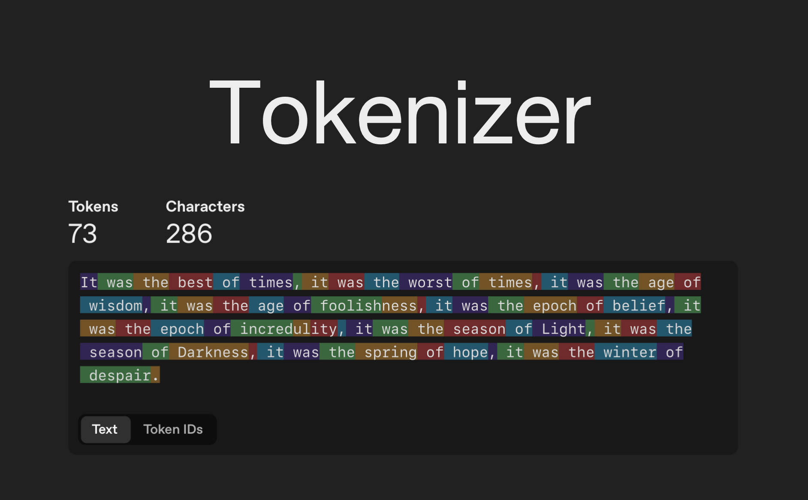
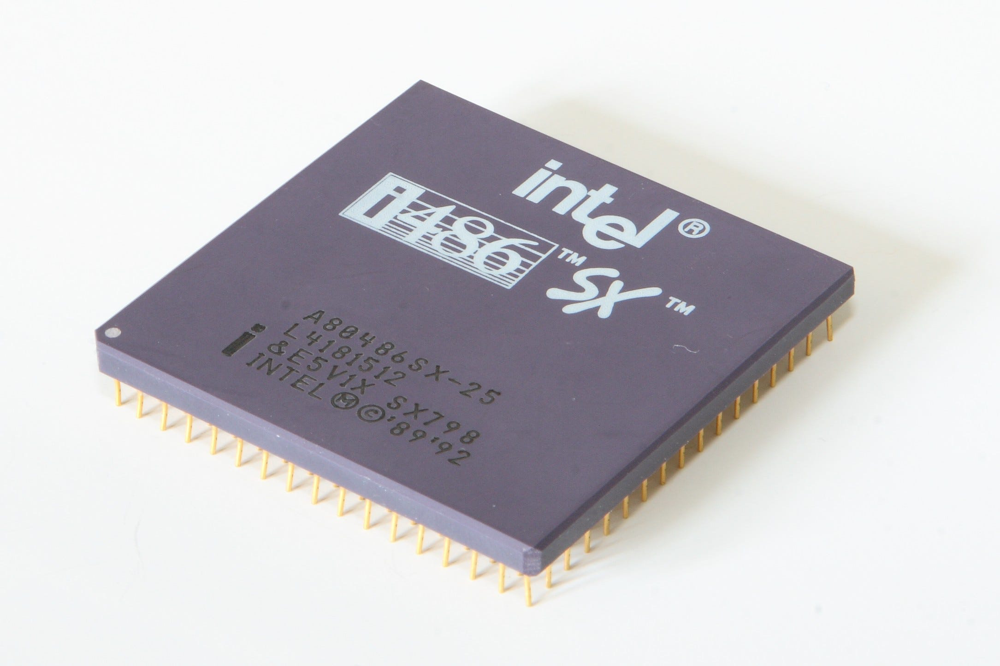

# The Token is Becoming the New Hidden Compute Primitive

Tokens are following the same path as CPU clock cycles…from headline metric to invisible infrastructure.





In the 1990s people compared megahertz. Then gigahertz. Then nobody cared anymore. The abstraction layers above the raw compute made clock cycles invisible. Tokens are on the same trajectory.

## Key Argument

Four data points tell the story:

- **Claude Code is not selling tokens** — it is selling outcomes. 4% of GitHub public commits are already authored by Claude Code.
- **Software creation cost is collapsing to near-zero** — the token is the unit of cost, but the value exchange happens at the task level.
- **Human-facing software is becoming infrastructure for AI Agents** — UIs are being replaced by APIs consumed by agents.
- **The entire datacenter buildout is a token throughput problem** — yet the end user never sees a single token count.

## The Abstraction Stack

```
1990s: Clock cycles → hidden by the OS
2000s: Server capacity → hidden by the cloud
2010s: API calls → hidden by SaaS platforms
2020s: Tokens → hidden by AI Agents
```

## Read the Full Blog

[blog.md](blog.md)

## Author

Cobus Greyling, Chief AI Evangelist @ Kore.ai
