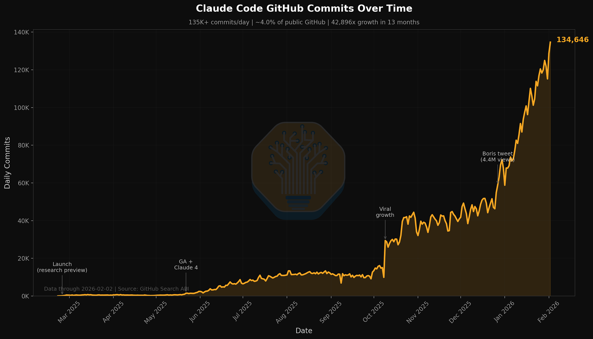
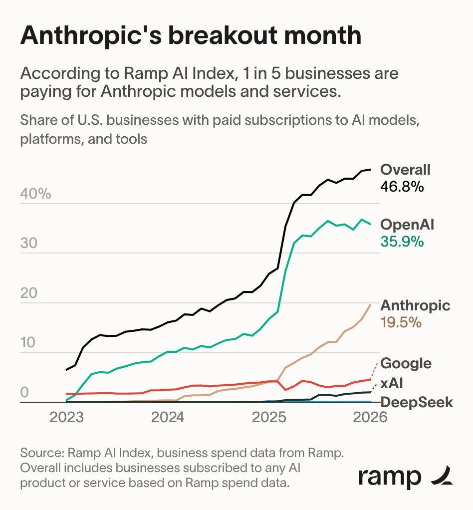
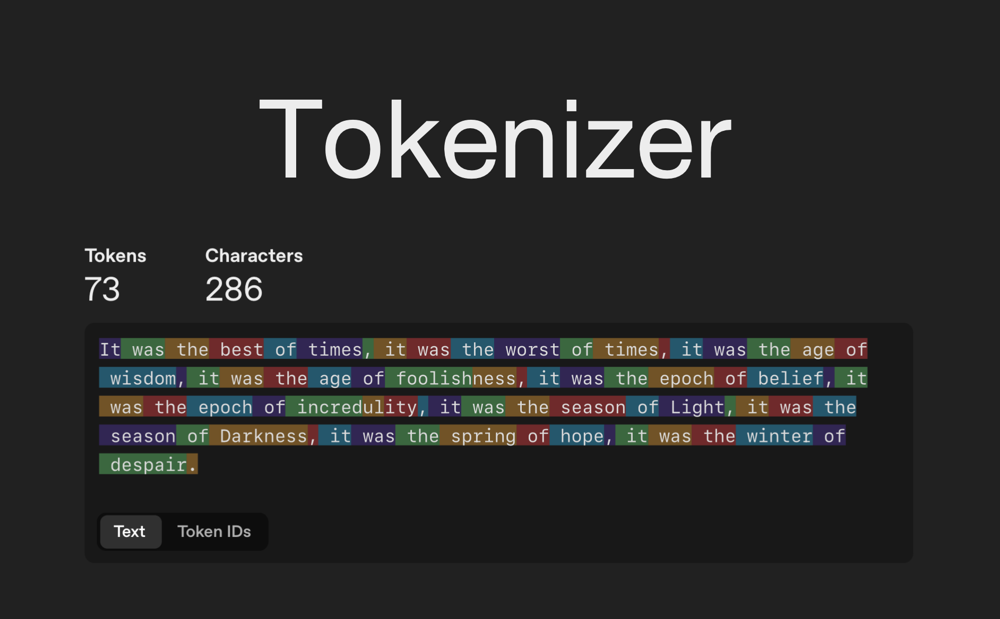

# The Token is Becoming the New Hidden Compute Primitive

## Tokens are following the same path as CPU clock cycles…from headline metric to invisible infrastructure.


In the 1990s people compared megahertz. Then gigahertz.
Then nobody cared anymore.

The abstraction layers above the raw compute…the operating system, the application, the cloud…made clock cycles invisible.
You stopped buying a processor.
You started buying an experience.

Tokens are on the same trajectory.

Right now we still talk about context windows, token costs, input versus output pricing.
We compare models by tokens per second.
We optimise prompts to save tokens.
We argue about whether 128K context is enough or whether we need 1M.

In 18 months, nobody outside infrastructure teams will mention tokens.

## The evidence is already here

Four data points tell the story…

### Claude Code is not selling tokens…

It is selling outcomes.
Fix this bug.
Build this feature.
Refactor this module.

Anthropic's revenue is growing faster than OpenAI's, and the product that is driving it does not surface token counts to the user.
The developer sees a task completed.
The tokens are consumed underneath, invisible.

SemiAnalysis reported that 4% of GitHub public commits are already authored by Claude Code, with a trajectory toward 20%+ by end of 2026.



### Software creation cost is collapsing to near-zero.

What once required thousands in development hours now costs cents in token consumption.
But the person generating the software never sees a token counter.
They see a finished application.

The token is the unit of cost, but the value exchange happens at the task level.

Fabricated Knowledge draws the parallel to how YouTube disrupted cable TV, when creation cost drops to near-zero, supply explodes and the traditional moat of high gross margins evaporates.

### Human-facing software is becoming infrastructure for AI Agents

UIs built for human eyes are being replaced by APIs consumed by agents.
The agent's context window is the new interface.
Software becomes a data layer that agents read from and write to.
The token is the new API call, but nobody calls it that.

Doug O'Laughlin argues that human-oriented consumption software will likely become obsolete.

**AI Agents and their context windows are the new "fast memory" while persistent data APIs become the valuable long-term storage layer.**



### The entire datacenter buildout is a token throughput problem

How many tokens per watt.
How many tokens per dollar.
How many tokens per GPU per second.

The supply side of AI is entirely denominated in tokens.
But the demand side…the users, the businesses, the workflows…never sees them.

SemiAnalysis tracks this through their Datacenter Industry Model (5,000+ facilities globally) and Tokenomics Model which maps GPU installed bases across hyperscalers to actual token consumption patterns.

The entire supply chain is denominated in token throughput…yet the end user never sees a single token count.

## The abstraction stack

This follows a pattern we have seen before.

```
1990s: Clock cycles → hidden by the OS
2000s: Server capacity → hidden by the cloud
2010s: API calls → hidden by SaaS platforms
2020s: Tokens → hidden by AI Agents
```

Each generation of compute had a raw primitive that was visible to early adopters, then progressively abstracted away as the ecosystem matured.

The token is at the early adopter stage right now.
We are the people comparing megahertz.
We are counting context windows the way system administrators used to count rack units.

The next layer of abstraction is the Agent Harness.

## The business model shift

This is where it gets interesting.

SaaS was sold per seat. You paid for a human using an interface.

AI is sold per outcome. You pay for a task completed by an agent.

The token is the unit of cost between those two layers.
But just as you never paid Amazon per CPU cycle on EC2 (you paid per instance-hour), you will not pay per token for long.
The pricing abstraction is already shifting.

Claude Code charges a flat subscription.
Cursor charges a flat subscription.
The token metering happens underneath, managed by the provider.
The user pays for capability, not for compute.

This means the competitive advantage shifts from who has the cheapest tokens to who has the best harness…the best context management, the best reasoning budget allocation, the best tool orchestration.
The raw token becomes a commodity.
The intelligence layer on top of it becomes the product.

## Considering builders

If you are building AI Agents today, I guess stop optimising for token cost and start optimising for token intelligence.

### Reasoning budget allocation

This matters more than raw model capability.
Nemotron 3 Super activates 12B parameters out of 120B per forward pass.
The model itself is already doing token-level optimisation at the architecture level.
Your harness should do the same at the application level.

### The harness is the product.

The model is interchangeable.
The tokens are a commodity.
The harness…the intelligence that manages context, allocates reasoning budgets, orchestrates tools, maintains instruction salience…is what separates a demo from a production system.

## Lastly

Five years from now, "token" will be a backend metric that infrastructure engineers monitor in dashboards.
Product teams will not mention it. Users will not know it exists.

The token is becoming the new hidden compute primitive.



---

*Chief AI Evangelist @ Kore.ai | I'm passionate about exploring the intersection of AI and language. From Language Models, AI Agents to Agentic Applications, Development Frameworks & Data-Centric Productivity Tools, I share insights and ideas on how these technologies are shaping the future.*
